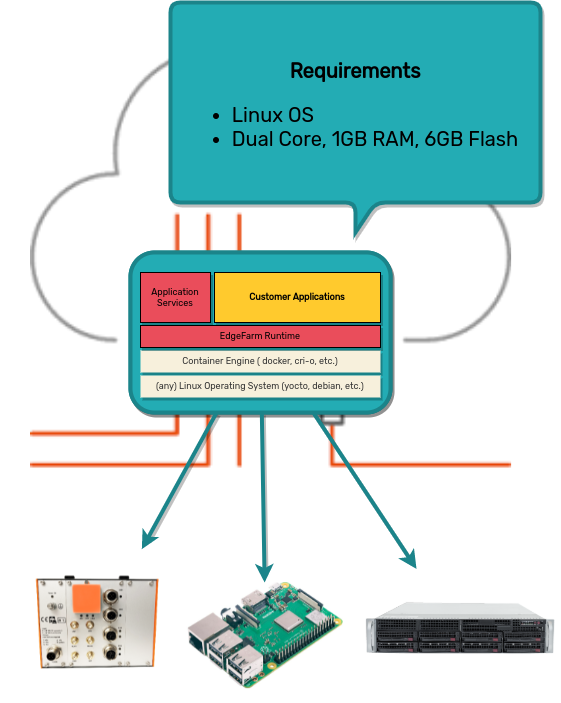

<!--
paginate: true
title: EdgeFarm Training
header: 'EdgeFarm Training'
footer: ''
style: |
  img[alt~="center"] {
    display: block;
    margin: 0 auto;
  }
  header, footer {
    font-size: 10pt;
  }
  h1{
      padding: 0;
      margin: 0;
  }
  h2, h3{
      padding: 0;
      margin: 5px;
  }
-->

# Who is EdgeFarm developed for?

**EdgeFarm was build for developers** 
- that are responsible for the realization of IoT projects
- who want to focus on their business logic rather than the day-to-day challenges that other developers have to worry about, namely:
  * Managing multiple devices
  * Rolling out firmware updates
  * Rolling out and updating applications
  * Collecting data like sensors and transporting it away from the device after pre-processing
  * Local data buffering in case the device is currently offline
  * Accessing exported data by third party systems

---

# Example Challenges

---

**Train and Bus Positioning**

- Positioning of Trains and Busses via GPS
- Train transmits its position independently
- Devices are connected either via Wifi or LTE modem
- Position is received by existing third party software

---

**Detection of malfunctions of the heating system in rental apartments**

- Sensors in the boiling room grab heating system information
- Edge devices located in the boiling room transports these information
- Devices are connected via LTE modem
- A cloud-based component monitors the data and informs the landlord promptly in the event of a failure.

---

**Wear detection in an assembly line**

- An assembly line has dozens of small wheels, pneumatic components, electric actors, sensors, running machines, ...
- Every minute of unplanned outage time costs the operator a lot of money
- The wear of specific parts can be monitored using sensors
- Several devices are hooked up to dozens of sensors that collect data
- Another Component collects the sensor data and triggers automatically the purchase process for spare parts.

**-> All of these are typical examples what EdgeFarm was developed for.**

---

# Architecture explained

---

---

---

---

---

---

---

---

---

---

---

---

---

---

---

That is the basic architecture of EdgeFarm.