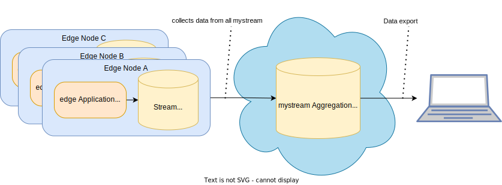

<!--
paginate: true
title: EdgeFarm Training
header: 'EdgeFarm Training'
footer: ''
style: |
  header, footer {
    font-size: 10pt;
  }
  h1{
      padding: 0;
      margin: 0;
  }
  h2, h3{
      padding: 0;
      margin: 5px;
  }
-->

# Required software and files

- [kubectl](https://kubernetes.io/docs/tasks/tools/#kubectl)
    It is used to communicate with the cluster and take actions like create, update, status or delete of resources on a Kubernetes cluster.

- kubeconfig file
    It contains the connection information and credentials to interact with a kubernets cluster.
    Saved to `~/.kube/config`.

---

# Edge devices explained

- Edge devices (Raspberry Pi, Moducop, ...) are represented as `nodes` in the Kubernets cluster.
* All `nodes` are treated the same within the cluster
    - Workload is deployed the same way
    - Interfacing with workload on the nodes in the same way
    - Status information is received the same way

---

Example view of nodes in the cluster: 

```sh
$ kubectl get nodes
NAME      STATUS   ROLES                      AGE   VERSION
dbs001-1  Ready    controlplane,etcd,worker   14d   v1.21.7
dbs001-2  Ready    controlplane,etcd,worker   14d   v1.21.7
dbs001-3  Ready    controlplane,etcd,worker   14d   v1.21.7
myNode1   Ready    agent,edge                 19h   v1.19.3-kubeedge-v1.9.1
myNode2   Ready    agent,edge                 19h   v1.19.3-kubeedge-v1.9.1
myNode3   Ready    agent,edge                 19h   v1.19.3-kubeedge-v1.9.1
```

Note the `edge` and `agent` roles for edge nodes.

---

# Manifests explained

- Every resource in a kubernetes cluster can be described in a so called manifest file.
- File format is [yaml](https://yaml.org/spec/1.2.2/).
- The file describes the desired state. The cluster aims to reach this state.

Applications to be rolled out using EdgeFarm are described with a specific application manifest.

The application is namespaced, that means it must be deployed to any namespace in the Kubernetes cluster.
`Namespaces` are used to isolate Resources from each other. 

---

## Namespace Manifest <!-- omit in toc -->

Let's say we have a file called `namespace.yaml` with the following content:

```yaml
kind: Namespace
apiVersion: v1
metadata:
  name: myapp
```
Let's create the namespace

```bash
$ kubectl apply -f namespace.yaml
$ kubectl get namespaces myapp
NAME   STATUS   AGE
myapp  Active   1m
```


---
## Application Manifest <!-- omit in toc -->
- The kind `Application` stands for the actual EdgeFarm application.
- An EdgeFarm application consists of one or more `components`, namely.
  - `edge-worker` and
  - `application-network`
```yaml
apiVersion: core.oam.dev/v1beta1
kind: Application
metadata:
  name: myapp
  namespace: myapp
spec:
  components:
    - <component>
    - ...
```
---
### Components

#### component `edge-worker`

- `edge-worker` describe containers to be rolled out on an edge device
* Via `runtime` you can select the `edge nodes` that shall receive the application.
  For the mapping between edge nodes and the application, label your edge nodes using `kubectl label <node> <key>=` (with empty value)
* If you put several values in the `runtime` field, the values are ANDed. This means the corresponding edge nodes must have all labels set.
* Via `traits` one or more additional properties can be defined for the container.

---

The component `mycomponent` of type `edge-worker` has a container image `docker.io/myuser/myimage:latest` and gets scheduled on devices that match the runtime `mydevice`.
```yaml
- type: edge-worker
  name: mycomponent
  properties:
    runtime:
      - mydevice
    image: docker.io/myuser/myimage:latest
    name: mycontainer
  traits:
    - <trait>
    - ...
```
---
#### Traits for `edge-worker`
**Volume trait**
There is a trait called `volumes`. Using the `volumes` trait you can configure access of the container to files or directories on the edge device.
```yaml
- type: volumes
  properties:
    volumes:
      - name: mount-name
        type: hostPath
        path: /data/path-on-host/
        mountPath: /path-in-container
        mountType: DirectoryOrCreate
        readOnly: false
```

See see the [hostPath](https://kubernetes.io/docs/concepts/storage/volumes/#hostpath) spec for options you can configure.

---

**edge-network-participant trait**

The trait `edge-network-partitipant` assigns a membership of the container in the networks listed. This enables the usage of `EdgeFarm.network` for this component with benefits like `buffered edge to cloud communication`. 

```yaml
- type: edge-network-participant
  properties:
    networks:
      - mynetwork
      - ...
```
---

#### component `application-network`

The `application-network` defines a communication network and its structure.
A network consists of any number of `subjects` and `streams`.

```yaml
- type: application-network
  name: mynetwork
  properties:
    subjects:
      - <subject>
      - ...
    streams:
      - <stream>
      - ...
```
---

The following rules and principles apply configuring the `application-network`:

- The communication via `EdgeFarm.network` uses PubSub and is `subject` based.
* A `stream` is used to buffer data in `EdgeFarm.network`. It is comparable with a bucket of messages with configurable characteristics and acting as a local buffer. If the bucket is full, it can be configured which data is dropped. 
* The size of the bucket can be configured. Pay attention to the device's capacities.
* A `subject` can be assigned to one single stream
* A `stream` can be assigned to multiple topics.
* Buffering is useful in scenarios where the edge node is not always connected to the upstream `EdgeFarm.network` and there should be no data loss.

---

## Full `application-network` spec

**properties**
```
+----------+----------------------------------------------------+-------------------------+----------+---------+
|   NAME   |                    DESCRIPTION                     |          TYPE           | REQUIRED | DEFAULT |
+----------+----------------------------------------------------+-------------------------+----------+---------+
| subjects | Subject defines the subjects of the network        | []subjects              | true     |         |
| streams  | Specify the streams to be created for the network. | []streams               | true     |         |
+----------+----------------------------------------------------+-------------------------+----------+---------+
```
**subjects**
```
+----------+------------------------------------------------+----------+----------+---------+
|   NAME   |                  DESCRIPTION                   |   TYPE   | REQUIRED | DEFAULT |
+----------+------------------------------------------------+----------+----------+---------+
| name     | name defines the name of the subject           | string   | true     |         |
| subjects | subject defines the subject                    | []string | true     |         |
| stream   | stream defines the stream name for the subject | string   | true     |         |
+----------+------------------------------------------------+----------+----------+---------+
```
---
**streams**
```
+----------+------------------------------------------------------------------------------+-------------------+----------+---------+
|   NAME   |                                 DESCRIPTION                                  |       TYPE        | REQUIRED | DEFAULT |
+----------+------------------------------------------------------------------------------+-------------------+----------+---------+
| name     | name defines the name of the stream                                          | string            | true     |         |
| location | location defines where the stream is located. Allowed values are: node, main | string            | true     | node    |
| config   | config defines the configuration of the stream                               | config            | true     |         |
| link     | link defines if the stream is linked to another stream                       | link              | false    |         |
+----------+------------------------------------------------------------------------------+-------------------+----------+---------+
```
**config**
```
+-------------------+------------------------------------------------------------------------------------------------------+--------+----------+---------+
|       NAME        |                                             DESCRIPTION                                              |  TYPE  | REQUIRED | DEFAULT |
+-------------------+------------------------------------------------------------------------------------------------------+--------+----------+---------+
| storage           | Streams are stored on the server, this can be one of many backends and all are usable in clustering  | string | false    | file    |
|                   | mode. Allowed values are: file, memory                                                               |        |          |         |
| retention         | Messages are retained either based on limits like size and age (Limits), as long as there are        | string | false    | limits  |
|                   | Consumers (Interest) or until any worker processed them (Work Queue). Allowed values are: limits,    |        |          |         |
|                   | interest, workqueue                                                                                  |        |          |         |
| maxMsgsPerSubject | MaxMsgsPerSubject defines the amount of messages to keep in the store for this Stream per unique     | int    | false    | -1      |
|                   | subject, when exceeded oldest messages are removed, -1 for unlimited.                                |        |          |         |
| maxMsgs           | MaxMsgs defines the amount of messages to keep in the store for this Stream, when exceeded oldest    | int    | false    | -1      |
|                   | messages are removed, -1 for unlimited.                                                              |        |          |         |
| maxBytes          | MaxBytes defines the combined size of all messages in a Stream, when exceeded oldest messages are    | int    | false    | -1      |
|                   | removed, -1 for unlimited.                                                                           |        |          |         |
| maxAge            | MaxAge defines the oldest messages that can be stored in the Stream, any messages older than this    | string | false    | 1y      |
|                   | period will be removed, -1 for unlimited. Supports units (s)econds, (m)inutes, (h)ours, (d)ays,      |        |          |         |
|                   | (M)onths, (y)ears.                                                                                   |        |          |         |
| maxMsgSize        | MaxMsgSize defines the maximum size any single message may be to be accepted by the Stream.          | int    | false    | -1      |
| discard           | Discard defines which messages shall be dropped. Allowed values are: old, new                        | string | false    | old     |
+-------------------+------------------------------------------------------------------------------------------------------+--------+----------+---------+
```
---
**link**
```
+--------+----------------------------------------------+--------+----------+---------+
|  NAME  |                 DESCRIPTION                  |  TYPE  | REQUIRED | DEFAULT |
+--------+----------------------------------------------+--------+----------+---------+
| stream | stream defines the name of the linked stream | string | true     |         |
+--------+----------------------------------------------+--------+----------+---------+
```
---

Full standard example:

- Devices labeles with `mydevice=` shall run the application
- Each device shall have one stream `mystream` with the following characteristics:
    - stored on filesystem for persistence over reboots
    - 50 MB max size
    - Limited by size and age
    - the oldeset messages can be 3 days old
    - 5000 maximum messages in the stream
    - if the stream is full, old messages shall be discarded
    - Unlimited maximum message Size
    - Unlimited messages per subject
---
- There shall be one aggregate stream that collects `mystream` from all nodes with the following characteristics:
    - stored on filesystem for persistence
    - 5 GB max size
    - Limited by size and age
    - the oldeset messages can be 2 weeks old
    - if the stream is full, old messages shall be discarded
    - Umlimited maximum messages in the stream
    - Unlimited maximum message Size
    - Unlimited messages per subject

---

The `EdgeFarm.network` shall look like this:


---

This is the corresponding namespace definition where the application should be deployed.

```yaml
apiVersion: v1
kind: Namespace
metadata:
  name: nats-box
```
---

The application definition `nats-box` that is participating in `nats-box-network`.

```yaml
apiVersion: core.oam.dev/v1beta1
kind: Application
metadata:
  name: nats-box
  namespace: nats-box
spec:
  components:
    - name: nats-box
      type: edge-worker
      properties:
        image: natsio/nats-box:latest
        name: nats-box
        runtime:
          - mydevice
        command:
          - /bin/sh
          - -c
          - --
        args:
          - "while true; do sleep 1; done;"
      traits:
        - type: edge-network-participant
          properties:
            networks:
              - nats-box-network
```
---

The application network `nats-box-network`  with `subjects` and `streams`.

```yaml              
apiVersion: core.oam.dev/v1beta1
kind: Application
metadata:
  name: nats-box
  namespace: nats-box
spec:
  components:
    - type: application-network
      name: nats-box-network
      properties:
        subjects:
          - name: mysubjects
            subjects:
              - "data.>"
              - "sensors.acc.>"
            stream: mystream
        streams:
          - name: mystream
            location: node
            config:
              storage: file
              retention: limits
              maxMsgs: 5000
              maxBytes: 52428800
              maxAge: 3d
              discard: old
          - name: mystream_aggregate
            location: main
            link:
              stream: mystream
            config:
              storage: file
              retention: limits
              maxBytes: 5242880000
              maxAge: 2W
              discard: old
```

---

# Resource handling using kubectl explained


## Apply and delete by manifests
```bash
$ kubectl apply -f <path-to-manifest-yaml>
<resource>/example created

$ kubectl delete -f <path-to-manifest-yaml>
<resource>/example deleted
```

Example:
```sh
$ kubectl apply -f namespace.yaml
namespace/mynamespace created

$ kubectl delete -f namespace.yaml
namespace/mynamespace deleted
```
---
## List applications
```bash
$ kubectl get applications -n <namespace>
```

Example:
```sh
$ kubectl get applications -n nats-box
NAME               COMPONENT          TYPE                  PHASE     HEALTHY   STATUS   AGE
nats-box           nats-box           edge-worker           running   true               1m
nats-box-network   nats-box-network   application-network   running   true               1m
```
---
## Delete applications
```bash
$ kubectl delete applications -n <namespace> <application> [<application>...]
```

Example:
```sh
# delete single application
$ kubectl delete applications -n nats-box nats-box
application.core.oam.dev "nats-box" deleted

# delete multiple applications
$ kubectl delete applications -n nats-box nats-box nats-box-network
application.core.oam.dev "nats-box" deleted
application.core.oam.dev "nats-box-network" deleted
```
---

## List pods which runs the applications
```bash
$ kubectl get pods -n <namespace> -o wide
```

Example:
```sh
$ kubectl get pods -n nats-box -o wide
NAME             READY   STATUS    RESTARTS   AGE   IP           NODE           NOMINATED NODE   READINESS GATES
nats-box-b99mh   3/3     Running   0          23h   172.17.0.4   mynode1        <none>           <none>
nats-box-dxwkj   3/3     Running   0          23h   172.17.0.4   mynode2        <none>           <none>
```
---

## Label nodes
Labels are used to roll out `applications` to specific nodes.

Looking at the nodes, edge nodes are marked with `ROLE` `agent` and `ROLE` `edge`:
```bash
$ kubectl get nodes
NAME                   STATUS   ROLES                      AGE     VERSION
control-plane-1        Ready    controlplane,etcd,worker   18h     v1.21.7
control-plane-2        Ready    controlplane,etcd,worker   18h     v1.21.7
control-plane-3        Ready    controlplane,etcd,worker   18h     v1.21.7
mynode1                Ready    agent,edge                 4h24m   v1.19.3-kubeedge-v1.9.1
mynode2                Ready    agent,edge                 2h56m   v1.19.3-kubeedge-v1.9.1
mynode3                Ready    agent,edge                 1h12m   v1.19.3-kubeedge-v1.9.1
```

```bash
# labeling a node with key and optional value
$ kubectl label node <node> [<node> ...] <key>=[<value>]

# get nodes that are labeld with key and optional value
$ kubectl get nodes -l <key>=[<value>]
```
---

Example:

```bash
$ kubectl label node mynode1 mynode2 mylabel=
node/mynode1 labeled
node/mynode2 labeled

$ kubectl get nodes -l mylabel=
NAME      STATUS   ROLES        AGE     VERSION
mynode1   Ready    agent,edge   4h25m   v1.19.3-kubeedge-v1.9.1
mynode2   Ready    agent,edge   2h57m   v1.19.3-kubeedge-v1.9.1
```

---

That's all for the Manifest explanations.