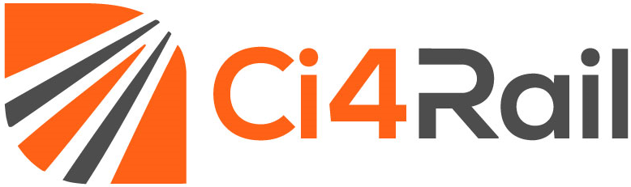

# EdgeFarm training

Welcome to the EdgeFarm training. Here you find everything to get you started using EdgeFarm.  

## Content

[Architecture explained](https://edgefarm-hands-on.github.io/edgefarm-training/architecture.html): Gives you a basic understanding about the components of EdgeFarm and its dependencies.
[Manifest exaplained](https://edgefarm-hands-on.github.io/edgefarm-training/manifest.html): This section explains how to define applications using so called manifest files
[Examples](https://edgefarm-hands-on.github.io/edgefarm-training/examples.html): This section contains some examples that can be rolled directly.  
[Known Bugs](https://edgefarm-hands-on.github.io/edgefarm-training/known_bugs.html): See the known bugs and current limitation.  

## Appendix

[Local development](https://edgefarm-hands-on.github.io/edgefarm-training/local_dev.html): Get's you started developing an application for EdgeFarm locally.
[Building container images exaplained](https://edgefarm-hands-on.github.io/edgefarm-training/building_images.html): Get's you started building multi-arch container images to run on your edge node.

