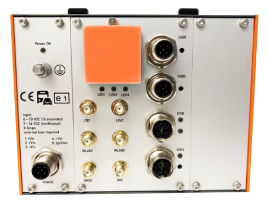
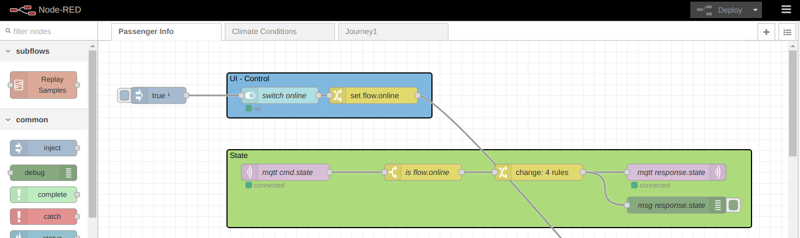
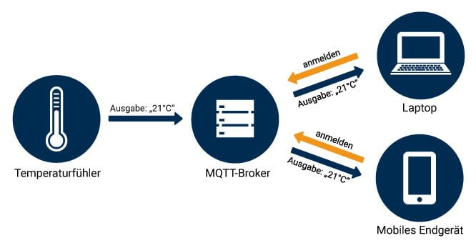
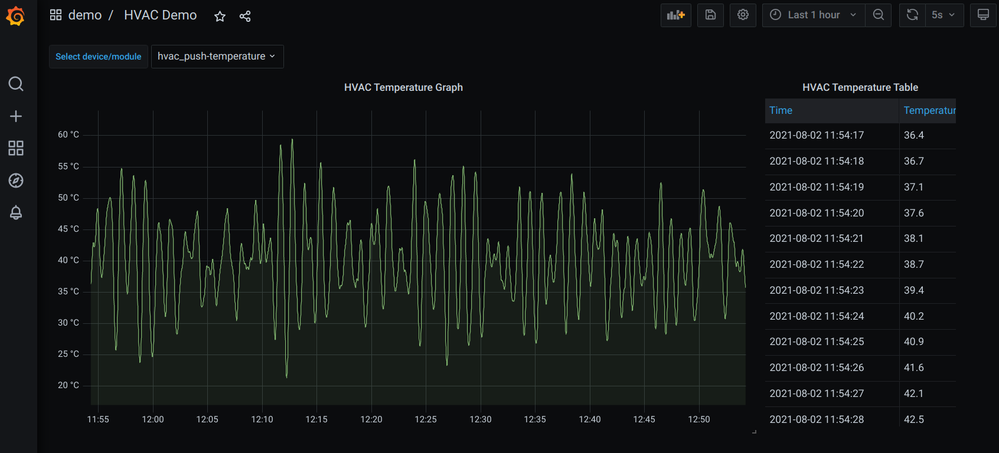

# Ablauf <!-- omit in toc -->
- [Entwicklungsumgebung](#entwicklungsumgebung)
  - [Benötigte Software](#benötigte-software)
  - [Benötigte Logins](#benötigte-logins)
  - [Bereitgestellte Umgebung](#bereitgestellte-umgebung)
- [Applikationen Entwickeln und Deployen](#applikationen-entwickeln-und-deployen)
  - [Train Simulator](#train-simulator)
  - [Ausführen auf Entwickler PC](#ausführen-auf-entwickler-pc)
  - [Applikation anpassen, bauen und ausführen](#applikation-anpassen-bauen-und-ausführen)
  - [Datenformat](#datenformat)
  - [Routing](#routing)
  - [Deployment](#deployment)
  - [Nutzung der Daten](#nutzung-der-daten)

---
# Entwicklungsumgebung
## Benötigte Software
| Software                                                                                           | Weshalb benötigt?                                                                                                               |
| -------------------------------------------------------------------------------------------------- | ------------------------------------------------------------------------------------------------------------------------------- |
| [Docker](https://docs.ci4rail.com/edgefarm/reference-manual/prerequisites/docker/)                 | Bauen von Applikationen auf dem Entwickler PC <br> Ausführen von Applikationen inklusive Entwicklungsumgebung auf Entwickler PC |
| [Docker-Compose](https://docs.ci4rail.com/edgefarm/reference-manual/prerequisites/docker-compose/) | Starten vom Train Simulator auf Entwickler PC                                                                                   |
| [QEMU](https://qemu.weilnetz.de/w64/)                                                              | Bauen der Applikationen auf dem Entwickler PC für das Zielsystem                                                                |

---

| Software                                                                                       | Weshalb benötigt?                                                                                                                                                                            |
| ---------------------------------------------------------------------------------------------- | -------------------------------------------------------------------------------------------------------------------------------------------------------------------------------------------- |
| [EdgeFarm CLI](https://docs.ci4rail.com/edgefarm/reference-manual/prerequisites/edgefarm-cli/) | Welche Geräte sind zum ausrollen von Applikationen verfügbar? <br> Sind sie online? <br> Deployment von Applikatinen auf das Edge Device ausführen <br> Status der Deployments auslesen <br> |
| [NATS CLI](https://github.com/nats-io/natscli#installation)                                    | Datenabgriff vom Datenendpunkt in der Cloud                                                                                                                                                  |
| [git](https://docs.ci4rail.com/edgefarm/reference-manual/prerequisites/git/) (optional)        | Automatisieren der Applikations Builds via Github Actions <br> Verwaltung der Software                                                                                                       |

---

## Benötigte Logins

| Login                                                                                | Weshalb benötigt?                                                                                                                                   |
| ------------------------------------------------------------------------------------ | --------------------------------------------------------------------------------------------------------------------------------------------------- |
| [Docker Hub](https://hub.docker.com/signup) <br> Alternativ: private Docker Registry | Ablegen der gebauten Applikationen (sog. Docker Images) <br> Edge Device downloaded sich die Docker Images von dieser Stelle und führt sie dann aus |
| [GitHub](https://github.com/join) (optional)                                         | Verwaltung der Software <br> Automatisieren der Applikations Builds via Github Actions                                                              |

---

## Bereitgestellte Umgebung
### EdgeFarm Zugänge <!-- omit in toc -->

| Information                                          | Weshalb benötigt?                                                            |
| ---------------------------------------------------- | ---------------------------------------------------------------------------- |
| EdgeFarm Account Name <br> EdgeFarm Account Password | Login Credentials für EdgeFarm CLI und Grafana Oberfläche                    |
| NATs Endpoint Credentials File                       | Datenabgriff vom Datenendpunkt in der Cloud                                  |
| KAFKA_ADDRESS <br> KAFKA_PASSWORD                    | Ausführen von Applikationen inklusive Entwicklungsumgebung auf Entwickler PC |

---

### Runtimes <!-- omit in toc -->



Edge Device `ModuCop`:
- Name:   axolotl
- Addresse: 192.168.24.19
- User: root
- Password: cheesebread

--- 

Virtuelles Device: 
- Name: demo_cloud
- Kann verwendet werden, wenn rechenintensive Anwendungen benötigt werden oder viele Datenvolumen-Intensiven Zugriffe in der Cloud gemacht werden sollen

---

### Simulator Device <!-- omit in toc -->

Raspberry Pi:
- Addressed: 192.168.24.42
- Node Red Oberfläche: http://192.168.24.42:1880/
- Node Red UI: http://192.168.24.42:1880/ui

---

# Applikationen Entwickeln und Deployen
## Train Simulator
### Übersicht <!-- omit in toc -->


---

### Was ist Node-Red? <!-- omit in toc -->
- Flow-Editor im Webbrowser
- Wird genutzt um Sensordaten zu Simulieren z.B. durch CSV import
- Sensordaten werden über MQTT bereitgestellt



---

### Was ist MQTT? <!-- omit in toc -->
Nachrichtenprotokoll für Netzwerke mit geringe Bandbreite und IoT-Geräte

Quelle: https://www.opc-router.de/was-ist-mqtt/

---

### Was ist Docker? <!-- omit in toc -->

Quelle: https://docs.docker.com/get-started/overview/

---

### Was ist Docker-Compose? <!-- omit in toc -->
- Ermöglicht automatisiertes hochfahren von mehreren Containern
- Über eine YAML Datei wird definiert was wie hochgefahren wird
- Ganze Infrastrukturen können schnell hochgefahren werden

---

### Was ist NATS? <!-- omit in toc -->
- Messaging System
- Wird in EdgeFarm für folgendes verwendet:
  - Modul zu Modul Kommunikation (also auf einem Device)
  - Device zu Cloud und Cloud zu Device Kommunikation
  - Bereitstellung eines Datenendpunkts in der Cloud zum Abgriff der Messdaten

---

### Was ist Grafana? <!-- omit in toc -->
- Ermöglicht es Daten in dynamischen interaktiven Dashboards zu visualisieren
- Moninoring von Systemen
- Visualisierung von Messdaten
- Erstellen von Alarmen, wenn Messwerte z.B. einen bestimmten Schwellwert überschreiten



---

### EdgeFarm Service Module <!-- omit in toc -->
- Abstraktion von Funktionalitäten
- Nutzung über SDK

#### mqtt-brige <!-- omit in toc -->
- Empfangen von Daten von einem MQTT Server
- Senden von Daten an einen MQTT Server 

#### ads-node-module <!-- omit in toc -->

- Senden von Daten in die Cloud

---

## Ausführen auf Entwickler PC
### Repository holen <!-- omit in toc -->
Repository mit Beispielen und Simulator clonen:
```
git clone git@github.com:edgefarm/train-simulation.git
```

---

### Optional: Train Simulator lokal starten <!-- omit in toc -->
Mit docker-compose hochfahren (Muss unter Windows in einer Admin Console ausgeführt werden):
```bash
$ cd simulator
$ docker-compose up 
```

Füge `mosquitto` to Hosts Datei `C:\Windows\System32\drivers\etc\hosts`:
```
127.0.0.1 mosquitto
```

---

### NATS Server starten <!-- omit in toc -->
```bash
$ docker run -p 4222:4222 \
             -p 6222:6222 \
             -p 8222:8222 \
             --name nats \
             --network simulator_edgefarm-simulator \
             -d nats
```

Füge `nats` to Hosts Datei `C:\Windows\System32\drivers\etc\hosts`:
```
127.0.0.1 nats
```

---

### EdgeFarm Service Module starten <!-- omit in toc -->

`mqtt-bridge` starten, verbinden auf lokalen MQTT Server:
```bash
$ docker run --network simulator_edgefarm-simulator  ci4rail/mqtt-bridge:latest
```

`mqtt-bridge` starten, verbinden auf MQTT Server auf Raspberry Pi:
```bash
$ docker run -e MQTT_SERVER=192.168.24.42:1883 \ 
             --network simulator_edgefarm-simulator ci4rail/mqtt-bridge:latest
```

---

Starten von `ads-to-evhub`, welcher das EdgeFarm Service Module `ads-node-module` in der Development Entwicklung ersetzt:
```bash
$ docker run -e KAFKA_ADDRESS=<KAFKA_ADDRESS> \
             -e KAFKA_PASSWORD=Endpoint=<KAFKA_PASSWORD> \
             --network simulator_edgefarm-simulator ci4rail/ads-to-evhub:latest
```

---

### Applikation ausführen <!-- omit in toc -->
Docker Image der Applikation bauen:
```bash
$ docker build -t <app name> --build-arg VERSION=main .
```

Docker Image ausführen:
```bash
$ docker run --network simulator_edgefarm-simulator <app name>
```
---

## Applikation anpassen, bauen und ausführen
### Applikation anpassen <!-- omit in toc -->

Beispiele sind im Repository [train-simulation](https://github.com/edgefarm/train-simulation) zu finden
- Auslesen von Temperatur und weiterleiten der unveränderten daten an EdgeFarm.data
- Simulation einer Sitzplatz Reservierung inklusive Monitoring
- Detektieren von Spitzen im vibration signal, zuordnung eines GPS-Standorts und weiterleiten der Daten in EdgeFarm.data

---

### Lokal bauen und ausführen <!-- omit in toc -->

Im Ordner Docker Image bauen:
```bash
$ docker build -t <docker repository>/<image name>[:<tag>] --build-arg VERSION=main .
```

Docker Image ausführen:
```bash
$ docker run <docker repository>/<image name>[:<tag>]
```

---


### Image in Docker Registry uploaden <!-- omit in toc -->

Mit Docker Account einloggen:
```bash
$ docker login
```

Image pushen:
```
docker push <docker repository>/<image name>:<tag>
```

---

### Cross Build <!-- omit in toc -->

Initial:
```bash
$ docker buildx create --use
```

Bauen und pushen mit buildx:
```bash
$ docker buildx build --push --platform linux/arm64,linux/amd64 --build-arg VERSION=main --tag <docker repository>/<image name>:<tag> .
```

---

## Datenformat
Apache Avro:
- Umfangreiche Datenstrukturen
- Kompaktes, schnelles, binäres Datenformat
- Library Support für viele Programmiersprachen
- Schemas 

---

```
{
    "name": "vibrationPeak",
    "type": "record",
    "fields": [
        {
            "name": "meta",
            "type": {
                "name": "t_meta",
                "type": "record",
                "fields": [
                    {
                        "name": "version",
                        "type": "bytes"
                    }
                ]
            }
        },
        {
            "name": "data",
            "type": {
                "name": "t_data",
                "type": "record",
                "fields": [
                    {
                        "name": "time",
                        "type": {
                            "doc": "time of measurement in microseconds since 1.1.1970",
                            "type": "long",
                            "logicalType": "timestamp-micros"
                        }
                    },
                    {
                        "doc": "Latitude (°)",
                        "name": "lat",
                        "type": "double"
                    },
                    {
                        "doc": "Longitude (°)",
                        "name": "lon",
                        "type": "double"
                    },
                    {
                        "doc": "RMS of measurement (m/s^2)",
                        "name": "vibrationIntensity",
                        "type": "double"
                    }
                ]
            }
        }
    ]
}
```

---


---

## Routing


---

## Deployment 
1. Deployment File
2. Deployment ausführen
3. Deployment löschen
4. Deployment Status überprüfen

---

### Deployment File <!-- omit in toc -->

```yaml
---
application: basis
modules:
  - name: mqtt-bridge
    image: ci4rail/mqtt-bridge:latest
    type: edge
    createOptions: "{}"
    labelSelector:
      rpi: axolotl
    imagePullPolicy: on-create
    restartPolicy: always
    status: running
    startupOrder: 1
    envs:
      MQTT_SERVER: 192.168.24.42:1883
```

---

### Deployment ausführen <!-- omit in toc -->

```bash
$ edgefarm applications apply -f <path/to/deployment file>
```

### Deployment löschen <!-- omit in toc -->
```bash
$ edgefarm applications delete deployment <application>
```

---

### Deployment Status überprüfen <!-- omit in toc -->

Deployments anzeigen per EdgeFarm CLI:
```bash
$ edgefarm applications get deployments
```

Status der Deployments anzeigen per EdgeFarm CLI:
```bash
$ edgefarm applications get deployments -o w -m
```

Auf dem Device kann man den status der laufenden Container sehen:
```bash
$ ssh root@192.168.24.19 
$ docker ps
```

---

## Nutzung der Daten
1. Datenvisualisierung mit Grafana
2. Datenexport mit NATS


---

### Datenvisualisierung mit Grafana <!-- omit in toc -->

- Ermitteln von `tenant ID`
  ```bash
   $ edgefarm applications get deployments
   +--------+-------------+---------------------+
    | TENANT | APPLICATION |    CREATION DATE    |
    +--------+-------------+---------------------+
    | demo   | basis       | 2021-07-30 10:21:16 |
    | demo   | hvac        | 2021-07-30 11:57:20 |
    +--------+-------------+---------------------+
  ```
- URL: https://<tenant ID>.grafana.edgefarm.io
- Login mit EdgeFarm Account über `Sign in with Auth0`
- Existierende `demo` Dashboards können über `Dashboards > Manage` erreicht werden

--- 

### Datenexport mit NATS <!-- omit in toc -->

Daten via NATS CLI abrufen:
```bash
$ nats consumer next EXPORT CUSTOMER \
        -s tls://connect.ngs.global:4222 \
        --creds=natsEndpoint.creds \
        -r
{"app":"hvac","module":"hvac_push-temperature","payload":{"temp":31.33},"time":"\"2021-08-31T06:20:12Z\""}
```
