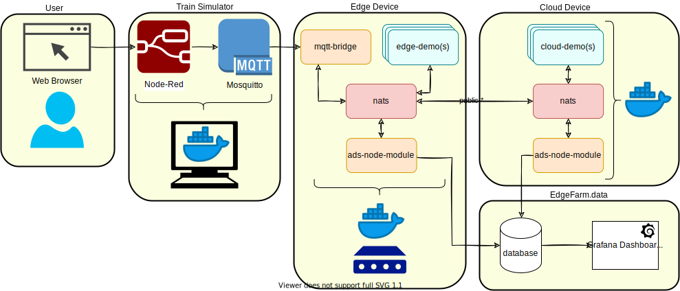
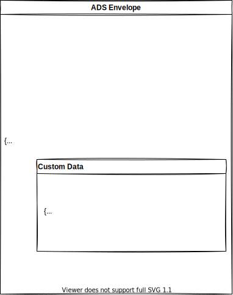
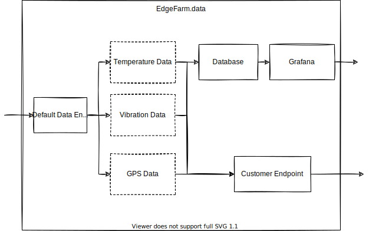

# Ablauf <!-- omit in toc -->
- [Entwicklungsumgebung](#entwicklungsumgebung)
  - [Benötigte Software](#benötigte-software)
  - [Benötigte Logins](#benötigte-logins)
  - [Bereitgestellte Umgebung](#bereitgestellte-umgebung)
- [Applikationen Entwickeln und Deployen](#applikationen-entwickeln-und-deployen)
  - [Train Simulator](#train-simulator)
  - [Ausführen auf Entwickler PC](#ausführen-auf-entwickler-pc)
  - [Docker Image](#docker-image)
  - [Datenformat](#datenformat)
  - [Routing](#routing)
  - [Deployment](#deployment)
    - [Deployment File](#deployment-file)
  - [Nutzung der Daten](#nutzung-der-daten)
    - [Datenvisualisierung mit Grafana](#datenvisualisierung-mit-grafana)
    - [Datenexport mit NATS](#datenexport-mit-nats)

---

# Entwicklungsumgebung
1. Benötigte Software
2. Benötigte Logins
3. Bereitgestellte Umgebung

---
<!-- header: Entwicklungsumgebung -->

## Benötigte Software
1. [WireGuard](https://www.wireguard.com/install/)
1. [Docker](https://docs.ci4rail.com/edgefarm/reference-manual/prerequisites/docker/)
2. [Docker-Compose](https://docs.ci4rail.com/edgefarm/reference-manual/prerequisites/docker-compose/)
3. [QEMU](https://qemu.weilnetz.de/w64/)
4. [EdgeFarm CLI](https://docs.ci4rail.com/edgefarm/reference-manual/prerequisites/edgefarm-cli/)
5. [NATS CLI](https://github.com/nats-io/natscli#installation) <!-- omit in toc -->
6. [git](https://docs.ci4rail.com/edgefarm/reference-manual/prerequisites/git/) (optional)

---

## Benötigte Logins
1. [Docker Hub](https://hub.docker.com/signup) (alternativ: andere private registry?)
2. [GitHub](https://github.com/join) (optional)

---

## Bereitgestellte Umgebung
1. EdgeFarm Zugänge
2. VPN Einrichten
3. Runtimes
4. Simulator Device

---

<!-- header: Entwicklungsumgebung - Bereitgestellte Umgebung -->

### EdgeFarm Zugänge <!-- omit in toc -->

Benötigte Informationen sind:
- VPN Private Key
- Tenant Name
- Account Name
- Account Password
- NATs Endpoint Credentials File
- IoT Device Connection String (zum Ausführen auf Entwickler PC)

Infos werden per Mail zur Verfügung gestellt.

---

### VPN Einrichten <!-- omit in toc -->

- WireGuard starten und mit `STRG + -` einen neuen Tunnel erstellen
- Namen für die Konfiguration eingeben: e.g. `ci4rail-vpn`
- Füge den folgenden Inhalt in die Konfigurations Feld:
    ```
    [Interface]
    PrivateKey = <VPN Private Key>
    Address = 10.7.0.2/24

    [Peer]
    PublicKey = 0vmHOS8fZJc3VLGqA9d7e/4XB5VAfcxGOmOXrJYghR0=
    AllowedIPs = 10.7.0.0/24, 192.168.24.19/32, 192.168.24.42/32
    Endpoint = 148.251.135.244:51821
    ```
- Speichern und Aktivieren der Konfiguration

---

### Runtimes <!-- omit in toc -->

Moducop:
- Name:   axolotl
- Addresse: 192.168.24.19
- User: root
- Password: cheesebread

Virtual Device: 
- Name: demo_cloud

---

### Simulator Device <!-- omit in toc -->

Raspberry Pi:
- Addressed: 192.168.24.42
- Node Red Oberfläche: http://192.168.24.42:1880/
- Node Red UI: http://192.168.24.42:1880/ui

---

<!-- header: "" -->

# Applikationen Entwickeln und Deployen
1. Train Simulator
2. Ausführen auf Entwickler PC
3. Docker Image
4. Datenformat
5. Routing
6. Deployment
7. Nutzung der Daten

---

<!-- header: Applikationen Entwickeln und Deployen -->

## Train Simulator


---

## Ausführen auf Entwickler PC

- Repository: https://github.com/edgefarm/train-simulation

TODO: Ausprobieren

---

## Docker Image

### Lokal bauen und ausführen <!-- omit in toc -->

Docker Image bauen:
```
docker build -t <docker repository>/<image name>[:<tag>] --build-arg VERSION=main .
```

Docker Image ausführen:
```
docker run <docker repository>/<image name>[:<tag>]
```

Image pushen:
```
docker push <docker repository>/<image name>[:<tag>]
```

---

<!-- header: Applikationen Entwickeln und Deployen - Docker Image -->

### Cross Build <!-- omit in toc -->

Bauen und pushen mit buildx:
```
docker buildx build --push --platform linux/arm64,linux/amd64 --build-arg VERSION=${VERSION} --tag <docker repository>/<image name>:[:<tag>] .
```

---

<!-- header: Applikationen Entwickeln und Deployen -->

## Datenformat
Apache Avro:
- Umfangreiche Datenstrukturen
- Kompaktes, schnelles, binäres Datenformat
- Library Support für viele Programmiersprachen
- Schemas 

---

<!-- header: Applikationen Entwickeln und Deployen - Datenformat -->

```
{
    "name": "vibrationPeak",
    "type": "record",
    "fields": [
        {
            "name": "meta",
            "type": {
                "name": "t_meta",
                "type": "record",
                "fields": [
                    {
                        "name": "version",
                        "type": "bytes"
                    }
                ]
            }
        },
        {
            "name": "data",
            "type": {
                "name": "t_data",
                "type": "record",
                "fields": [
                    {
                        "name": "time",
                        "type": {
                            "doc": "time of measurement in microseconds since 1.1.1970",
                            "type": "long",
                            "logicalType": "timestamp-micros"
                        }
                    },
                    {
                        "doc": "Latitude (°)",
                        "name": "lat",
                        "type": "double"
                    },
                    {
                        "doc": "Longitude (°)",
                        "name": "lon",
                        "type": "double"
                    },
                    {
                        "doc": "RMS of measurement (m/s^2)",
                        "name": "vibrationIntensity",
                        "type": "double"
                    }
                ]
            }
        }
    ]
}
```

---



---

<!-- header: Applikationen Entwickeln und Deployen -->

## Routing



---

## Deployment 
1. Deployment File
2. Deployment ausführen
3. Deployment status überprüfen
   1. Per CLI
   2. Auf dem Device
4. Deployment löschen

---

<!-- header: Applikationen Entwickeln und Deployen - Deployment -->

### Deployment File

```yaml
---
application: basis
modules:
  - name: mqtt-bridge
    image: ci4rail/mqtt-bridge:latest
    type: edge
    createOptions: "{}"
    labelSelector:
      rpi: axolotl
    imagePullPolicy: on-create
    restartPolicy: always
    status: running
    startupOrder: 1
    envs:
      MQTT_SERVER: 192.168.24.42:1883
```
---

## Nutzung der Daten
1. Datenvisualisierung mit Grafana
2. Datenexport mit NATS


---

### Datenvisualisierung mit Grafana

- URL: https://<tenant ID>.grafana.edgefarm.io
- Login mit EdgeFarm Account über `Sign in with Auth0`
- Existierende `demo` Dashboards können über `Dashboards > Manage` erreicht werden

--- 

### Datenexport mit NATS

Daten via NATS CLI abrufen:
```bash
$ nats consumer next EXPORT CUSTOMER \
        -s tls://connect.ngs.global:4222 \
        --creds=natsEndpoint.creds \
        -r
{"app":"hvac","module":"hvac_push-temperature","payload":{"temp":31.33},"time":"\"2021-08-31T06:20:12Z\""}
```
