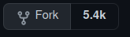
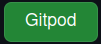
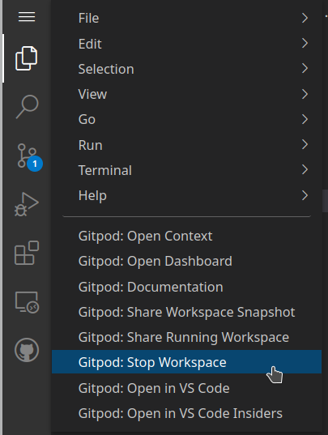
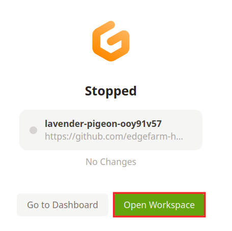
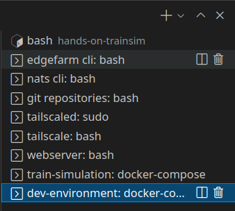

# Ablauf <!-- omit in toc -->
- [Entwicklungsumgebung](#entwicklungsumgebung)
  - [Benötigte Software](#benötigte-software)
  - [Benötigte Logins](#benötigte-logins)
  - [Bereitgestellte Umgebung](#bereitgestellte-umgebung)
- [Applikationen Entwickeln und Deployen](#applikationen-entwickeln-und-deployen)
  - [Train Simulator](#train-simulator)
  - [Ausführen auf gitpod](#ausführen-auf-gitpod)
  - [Applikation anpassen und ausführen](#applikation-anpassen-und-ausführen)
  - [Datenformat](#datenformat)
  - [Routing](#routing)
  - [Deployment](#deployment)
  - [Nutzung der Daten](#nutzung-der-daten)

---
# Entwicklungsumgebung
## Benötigte Software
| Software                                                                  | Weshalb benötigt?                                                    |
| ------------------------------------------------------------------------- | -------------------------------------------------------------------- |
| Browser (z.B. Firefox)                                                    | Ausführen von Applikationen in einer Entwicklungsumgebung im Browser |
| [GitPod Browser Extension](https://www.gitpod.io/docs/browser-extension/) | Einfacheres Öffnen von Github Repositories in GitPod                 |


---

## Benötigte Logins

| Login                                                                                | Weshalb benötigt?                                                                                                                                   |
| ------------------------------------------------------------------------------------ | --------------------------------------------------------------------------------------------------------------------------------------------------- |
| [Docker Hub](https://hub.docker.com/signup) <br> Alternativ: private Docker Registry | Ablegen der gebauten Applikationen (sog. Docker Images) <br> Edge Device downloaded sich die Docker Images von dieser Stelle und führt sie dann aus |
| [GitHub](https://github.com/join)                                                    | Verwaltung der Software <br> Automatisieren der Applikations Builds via Github Actions / Bauen der Docker Images für das Zielsystem                 |
| [GitPod](https://www.gitpod.io/#get-started)                                         | Starten einer Visual Studio Code Entwicklungsumgebung im Browser <br> GitHub Account kann wiederverwendet werden                                    |

---

## Bereitgestellte Umgebung
### EdgeFarm Zugänge <!-- omit in toc -->

| Information                                          | Weshalb benötigt?                                                            |
| ---------------------------------------------------- | ---------------------------------------------------------------------------- |
| EdgeFarm Account Name <br> EdgeFarm Account Password | Login Credentials für EdgeFarm CLI und Grafana Oberfläche                    |
| NATs Endpoint Credentials File                       | Datenabgriff vom Datenendpunkt in der Cloud                                  |
| KAFKA_ADDRESS <br> KAFKA_PASSWORD                    | Ausführen von Applikationen inklusive Entwicklungsumgebung auf Entwickler PC |

---

### Runtimes <!-- omit in toc -->


Edge Device `ModuCop`:
- Name:   axolotl

--- 

Virtuelles Device: 
- Name: demo_cloud
- Kann verwendet werden, wenn rechenintensive Anwendungen benötigt werden oder viele Datenvolumen-Intensiven Zugriffe in der Cloud gemacht werden sollen

---

### Simulator Device <!-- omit in toc -->

Raspberry Pi:
- Name: axolotl-rpi
- Node Red Oberfläche: 8080-<gitpod URL>/
- Node Red UI: 8080-<gitpod URL>/ui/

---

# Applikationen Entwickeln und Deployen
## Train Simulator
### Übersicht <!-- omit in toc -->


---

### Was ist Node-Red? <!-- omit in toc -->
- Flow-Editor im Webbrowser
- Wird genutzt um Sensordaten zu Simulieren z.B. durch CSV import
- Sensordaten werden über MQTT bereitgestellt


---

### Was ist MQTT? <!-- omit in toc -->
Nachrichtenprotokoll für Netzwerke mit geringe Bandbreite und IoT-Geräte

Quelle: https://www.opc-router.de/was-ist-mqtt/

---

### Was ist Docker? <!-- omit in toc -->

Quelle: https://docs.docker.com/get-started/overview/

---

### Was ist Docker-Compose? <!-- omit in toc -->
- Ermöglicht automatisiertes hochfahren von mehreren Containern
- Über eine YAML Datei wird definiert was wie hochgefahren wird
- Ganze Infrastrukturen können schnell hochgefahren werden

---

### Was ist NATS? <!-- omit in toc -->
- Messaging System
- Wird in EdgeFarm für folgendes verwendet:
  - Modul zu Modul Kommunikation (also auf einem Device)
  - Device zu Cloud und Cloud zu Device Kommunikation
  - Bereitstellung eines Datenendpunkts in der Cloud zum Abgriff der Messdaten

---

### Was ist Grafana? <!-- omit in toc -->
- Ermöglicht es Daten in dynamischen interaktiven Dashboards zu visualisieren
- Moninoring von Systemen
- Visualisierung von Messdaten
- Erstellen von Alarmen, wenn Messwerte z.B. einen bestimmten Schwellwert überschreiten


---

### EdgeFarm Service Module <!-- omit in toc -->
- Abstraktion von Funktionalitäten
- Nutzung über SDK

#### mqtt-brige <!-- omit in toc -->
- Empfangen von Daten von einem MQTT Server
- Senden von Daten an einen MQTT Server 

#### ads-node-module <!-- omit in toc -->

- Senden von Daten in die Cloud

---

## Ausführen auf gitpod
### Repositories forken <!-- omit in toc -->
> Dieser Schritt ist nur nötig, whenn Änderungen in GitHub persistent gespeichert werden sollen oder wenn ein Cross Build für die Zielplattform erfolgen soll.

Erstelle einen [Fork](https://docs.github.com/en/get-started/quickstart/fork-a-repo) für die folgendne Repositories (drücke den `Fork`-Button, z.B.: ):
* [edgefarm-hands-on/hands-on-trainsim](https://github.com/edgefarm-hands-on/hands-on-trainsim)
  (this repository)
* [edgefarm/train-simulation](https://github.com/edgefarm-hands-on/hands-on-trainsim)

---

### GitHub Actions vorbereiten <!-- omit in toc -->
> Dieser Schritt ist notwendig, wenn Applikationen für die Zielhardware gebaut werden sollen.

1. Gehe in github zum geforkten `train-simulation`-Repository (normalerweise https://github.com/YOURUSERNAME/train-simulation)
2. Unter dem Repository Namen klicke auf `Settings`
3. In der linken Sidebar drücke `Secrets`.
4. Durch drücken auf `New repository secret` füge die folgenden Secrets hinzu, fülle die Werte mit den Docker Hub Zugangsdaten, die im Rahmen der [benötigten Logins](#benötigte-logins) erstellt wurden:
   1. Name: DOCKER_USERNAME
   2. Name: DOCKER_PASSWORD

---

### Aufsetzen von Tailscale Secret <!-- omit in toc -->

> Dieser Schritt ist notwendig, wenn Hardware, die im Ci4Rail Büro steht, benutzt werden soll.

1. Gehe zur Tailscale [Admin Seite](https://login.tailscale.com/admin/settings/authkeys) und erstelle einen `Ephemeral Key`
2. Gehe zur GitPod [Settings Page](https://gitpod.io/variables) und erstelle eine Variable mit dem Namen `TAILSCALE_AUTHKEY` und dem `Ephemeral Key` als Wert

---

### GitPod Starten <!-- omit in toc -->

**Browser Extension installiert:**

Gehe zum (geforkten) `hands-on-trainsim` Github Repository 
(normalerweise https://github.com/YOURUSERNAME/hands-on-trainsim) und drücke den Gitpod Button .

> Falls das Repository nicht geforkt wurde, gehe auf [edgefarm-hands-on/hands-on-trainsim](https://github.com/edgefarm-hands-on/edgefarm-training)

**Ohne Browser Extension:**

Tippe `https://gitpod.io/#YOURUSERNAME/hands-on-trainsim` in den Browser und ersetze `YOURUSERNAME`.

> Falls das Repository nicht geforkt wurde, gehe auf [GitPod edgefarm-hands-on/hands-on-trainsim](https://gitpod.io/edgefarm-hands-on/hands-on-trainsim)

---

### Anpassen Geforkter Repositories <!-- omit in toc -->

Öffne `.gitpod.yml` im `hands-on-trainsim` Repository, passe alle Repositories an, sodass sie auf die geforkten zeigen und commite/pushe die Änderungen.

Nach den Anpassungen, starte einen neuen Workspace.

---

### Connect to EdgeFarm Data <!-- omit in toc -->

Kopiere die Kafka Konfigurations Datei und benenne sie um:
```
cp /workspace/train-simulation/dev-environment/example.kafka.env /workspace/train-simulation/dev-environment/.kafka.env
```

Füge die Zugangsdaten (bereitgestellt von Ci4Rail GmbH)  in die Datei ein und starte den GitPod Workspace neu.

---

### GitPod Workspace Neu Starten <!-- omit in toc -->

Klicke auf das Hamburger Menü links oben im GitPod und drücke auf `Gitpod: Stop Workspace`



---

Wenn das stoppen abgeschlossen ist, öffne den Workspace durch klicken auf `Open Workspace` neu.



---

### Nutze das Bereitgestellte Simulator Device (optional) <!-- omit in toc -->

Ändere die Umgebungsvariable `MQTT_SERVER` im File `train-simulation/dev-environment/docker-compose.yaml` sodass sie dem Name des Raspberry Pi Devices entspricht (Bereitgestellt von Ci4Rail GmbH):
```
  mqtt-bridge:
    image: ci4rail/mqtt-bridge:latest
    networks:
      - edgefarm-simulator
    environment:
      - MQTT_SERVER=<Raspberry Pi Name>:1883
```

---

Gehe in die Konsole `dev-environment` und terminiere die Docker-Compose Ausführung mit `STRG + C`.



Starte es neu mit:
```
docker-compose -f /workspace/train-simulation/dev-environment/docker-compose.yaml up
```

---

## Applikation anpassen und ausführen
### Applikation anpassen <!-- omit in toc -->

Beispiele sind im Repository [train-simulation](https://github.com/edgefarm/train-simulation) zu finden
- Auslesen von Temperatur und weiterleiten der unveränderten daten an EdgeFarm.data
- Simulation einer Sitzplatz Reservierung inklusive Monitoring
- Detektieren von Spitzen im vibration signal, zuordnung eines GPS-Standorts und weiterleiten der Daten in EdgeFarm.data

---

### Applikation ausführen <!-- omit in toc -->

Gehe in den Ordner der Applikation der selektierten Beispielanwendung, z.B. `usecase1`:
```
cd /workspace/train-simulation/usecase-1/push-temperature
```

Installiere die benötigten Bibliotheken:
```
pip3 install -r requirements.txt
```

Gehe in das `src` Verzeichniss, stelle die benötigte Umgebungsvariable bereit und führe die Applikation aus:
```
cd src
export NATS_SERVER=127.0.0.1:4222
python3 main.py
```

---

## Datenformat
Apache Avro:
- Umfangreiche Datenstrukturen
- Kompaktes, schnelles, binäres Datenformat
- Library Support für viele Programmiersprachen
- Schemas 

---

```
{
    "name": "vibrationPeak",
    "type": "record",
    "fields": [
        {
            "name": "meta",
            "type": {
                "name": "t_meta",
                "type": "record",
                "fields": [
                    {
                        "name": "version",
                        "type": "bytes"
                    }
                ]
            }
        },
        {
            "name": "data",
            "type": {
                "name": "t_data",
                "type": "record",
                "fields": [
                    {
                        "name": "time",
                        "type": {
                            "doc": "time of measurement in microseconds since 1.1.1970",
                            "type": "long",
                            "logicalType": "timestamp-micros"
                        }
                    },
                    {
                        "doc": "Latitude (°)",
                        "name": "lat",
                        "type": "double"
                    },
                    {
                        "doc": "Longitude (°)",
                        "name": "lon",
                        "type": "double"
                    },
                    {
                        "doc": "RMS of measurement (m/s^2)",
                        "name": "vibrationIntensity",
                        "type": "double"
                    }
                ]
            }
        }
    ]
}
```

---


---

## Routing


---

## Deployment 
1. Cross Build
2. Deployment File
3. Deployment ausführen
4. Deployment löschen
5. Deployment Status überprüfen

---

### Cross Build <!-- omit in toc -->

#### Setup github actions <!-- omit in toc -->

> Vorbedingung: Geforkte Repositories

1. Gehe auf GitHub zum geforkten `train-simulation`-Repository (normalerweiße https://github.com/YOURUSERNAME/train-simulation)
2. Unter dem Repository Name klicke auf `Settings`
3. In der Linken Sidebar klicke auf `Secrets`.
4. Füge durch klicken auf `New repository secret` die folgenden Secrets hinzu, fülle die Werte mit den Zugansdaten des Docker Hub Accounts erstellt im Schritt [Benötigte Logins](#benötigte-logins):
   1. Name: DOCKER_USERNAME
   2. Name: DOCKER_PASSWORD

---

#### Trigger Build <!-- omit in toc -->

Ein Build wird mithilfe von GitHub Actions durch folgende Aktionen getriggert:
- Push auf main: `DOCKER_USERNAME/<application-name>`
- Push auf Feature Branch, wenn ein Pull Request auf diesem vorliegt: `DOCKER_USERNAME/dev-<application-name>`

---

### Deployment File <!-- omit in toc -->

```yaml
---
application: basis
modules:
  - name: mqtt-bridge
    image: ci4rail/mqtt-bridge:latest
    type: edge
    createOptions: "{}"
    labelSelector:
      rpi: axolotl
    imagePullPolicy: on-create
    restartPolicy: always
    status: running
    startupOrder: 1
    envs:
      MQTT_SERVER: 192.168.24.42:1883
```

---

### Deployment ausführen <!-- omit in toc -->

```bash
$ edgefarm applications apply -f <path/to/deployment file>
```

### Deployment löschen <!-- omit in toc -->
```bash
$ edgefarm applications delete deployment <application>
```

---

### Deployment Status überprüfen <!-- omit in toc -->

Deployments anzeigen per EdgeFarm CLI:
```bash
$ edgefarm applications get deployments
```

Status der Deployments anzeigen per EdgeFarm CLI:
```bash
$ edgefarm applications get deployments -o w -m
```

Auf dem Device kann man den status der laufenden Container sehen:
```bash
$ ssh root@192.168.24.19 
$ docker ps
```

---

## Nutzung der Daten
1. Datenvisualisierung mit Grafana
2. Datenexport mit NATS

---

### Datenvisualisierung mit Grafana <!-- omit in toc -->

- Ermitteln von `tenant ID`
  ```bash
   $ edgefarm applications get deployments
   +--------+-------------+---------------------+
    | TENANT | APPLICATION |    CREATION DATE    |
    +--------+-------------+---------------------+
    | demo   | basis       | 2021-07-30 10:21:16 |
    | demo   | hvac        | 2021-07-30 11:57:20 |
    +--------+-------------+---------------------+
  ```
- URL: https://<tenant ID>.grafana.edgefarm.io
- Login mit EdgeFarm Account über `Sign in with Auth0`
- Existierende `demo` Dashboards können über `Dashboards > Manage` erreicht werden

--- 

### Datenexport mit NATS <!-- omit in toc -->

Daten via NATS CLI abrufen:
```bash
$ nats consumer next EXPORT CUSTOMER \
        -s tls://connect.ngs.global:4222 \
        --creds=natsEndpoint.creds \
        -r
{"app":"hvac","module":"hvac_push-temperature","payload":{"temp":31.33},"time":"\"2021-08-31T06:20:12Z\""}
```
