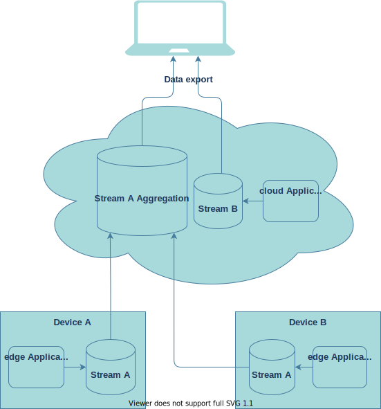
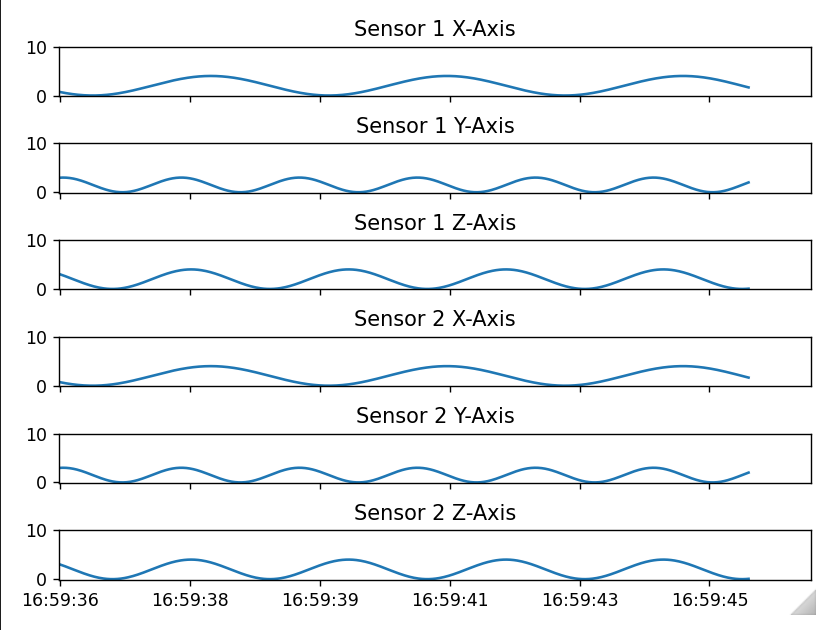

# Ablauf <!-- omit in toc -->
- [Entwicklungsumgebung](#entwicklungsumgebung)
  - [Benötigte Software](#benötigte-software)
  - [Benötigte Logins](#benötigte-logins)
  - [Bereitgestellte EdgeFarm Zugänge](#bereitgestellte-edgefarm-zugänge)
- [Applikationen Entwickeln und Deployen](#applikationen-entwickeln-und-deployen)
  - [Minimale Beispiele](#minimale-beispiele)
  - [Applikation lokal ausführen](#applikation-lokal-ausführen)
  - [Docker Image bauen und hochladen](#docker-image-bauen-und-hochladen)
  - [Deployment](#deployment)
  - [Nutzung der Daten](#nutzung-der-daten)

---

# Entwicklungsumgebung
## Benötigte Software
| Software                                                                                           | Weshalb benötigt?                                                                                                                                                                       |
| -------------------------------------------------------------------------------------------------- | --------------------------------------------------------------------------------------------------------------------------------------------------------------------------------------- |
| [Docker](https://docs.ci4rail.com/edgefarm/reference-manual/prerequisites/docker/)                 | Ausführen und Bauen von Containern. Wird benötigt, um Applikationen in einen Container zu verpacken und somit für die Bereitstellung auf das Zielgerät vorzubereiten.                   |
| [Docker-Compose](https://docs.ci4rail.com/edgefarm/reference-manual/prerequisites/docker-compose/) | Ein Tool zum Definieren und Ausführen von Docker-Anwendungen mit mehreren Containern. Wird verwendet, um Entwicklungsumgebung auf dem Rechner hochzufahren um lokal debuggen zu können. |

---

| Software                                                   | Weshalb benötigt?                                                                                                                                                                                                                                                                                                                                                                                                                                       |
| ---------------------------------------------------------- | ------------------------------------------------------------------------------------------------------------------------------------------------------------------------------------------------------------------------------------------------------------------------------------------------------------------------------------------------------------------------------------------------------------------------------------------------------- |
| [QEMU](https://www.qemu.org/download/)                     | QEMU ermöglicht es Docker Container für eine andere Architektur zu bauen, als die des Entwicklungs-PCs auf dem der Build ausgeführt wird. Der ModuCop oder auch der Raspberry Pi haben z.B. einen ARM64 Prozessor, währen die Entwicklungs-PCs normalerweise eine x64-Prozessor Archtektur haben. Somit ist es notwendig, einen sogenannten Cross-Build auszuführen, um eine auf einem Entwickler-PC gebaute Applikation auf einem ModuCop auszuführen. |
| [kubectl](https://kubernetes.io/docs/tasks/tools/#kubectl) | Befehlszeilenprogramm um Komponenten (z.B. Applikationen) auf einem Kubernetes Cluster zu erstellen, löschen oder aktualisieren.                                                                                                                                                                                                                                                                                                                        |


---

| Software                                                                                | Weshalb benötigt?                                                                      |
| --------------------------------------------------------------------------------------- | -------------------------------------------------------------------------------------- |
| [Visual Studio Code](https://code.visualstudio.com/download)                            | Debuggen der Beispiel Applikation                                                      |
| [git](https://docs.ci4rail.com/edgefarm/reference-manual/prerequisites/git/) (optional) | Herunterladen der Beispielprogramme (können aber auch als ZIP heruntergeladen werden.) |

---

## Benötigte Logins

| Login                                                                                | Weshalb benötigt?                                                                                                                                                         |
| ------------------------------------------------------------------------------------ | ------------------------------------------------------------------------------------------------------------------------------------------------------------------------- |
| [Docker Hub](https://hub.docker.com/signup) <br> Alternativ: private Docker Registry | Ablegen der gebauten Applikationen (sog. Docker Images) <br> Edge Device downloaded sich die Docker Images von dieser Stelle und führt sie dann aus.                      |
| [github](https://github.com/join) (optional)                                         | Herunterladen der Beispielprogramme (können aber auch als ZIP heruntergeladen werden.) <br> Automatisiertes bauen der Applikations Container mithilfe von GitHub Actions. |

---

## Bereitgestellte EdgeFarm Zugänge

| Information     | Weshalb benötigt?                                                                                                                                                                                    |
| --------------- | ---------------------------------------------------------------------------------------------------------------------------------------------------------------------------------------------------- |
| kubeconfig file | Mit dem tool `kubectl` können Applikationen ausgerollt werden, deren Status überprüft werden und die Logs der einzelnen Applikationen angezeigt werden. <br> Wird nach `~/.kube/config` gespeichert. |

---

# Applikationen Entwickeln und Deployen
## Minimale Beispiele
Minitmale Beispiele sind im Repository [examples](https://github.com/edgefarm/examples) zu finden
- [Mounten eines Ordners in eine EdgeFarm Applikation](https://github.com/edgefarm/examples/tree/main/mount)
- [Das Exportieren von Daten aus EdgeFarm.network](https://github.com/edgefarm/examples/tree/main/data-export)

---

## Applikation lokal ausführen

Gehe in den Ordner des Beispiels, z.B. `data-export`.
```bash
cd data-export
```

### Dev Umgebung hochfahren <!-- omit in toc -->
Falls ein `dev` Ordner vorhanden ist, so fahre die lokale Dev Umgebung folgendermaßen hoch:
```bash
cd dev
docker-compose up -d
cd ..
```

---

In diesem Bespiel muss zusätzlich ein lokaler Stream angelegt werden:

```bash
$ docker run -it --rm --network host \
    --entrypoint /bin/nats \
    synadia/nats-server:nightly \
    -s nats://localhost:4222 stream add \
        test --subjects "EXPORT.*" \
        --ack --max-msgs=100000 \
        --max-bytes=1073741824 \
        --max-age=2d \
        --storage file \
        --retention limits \
        --max-msg-size=-1 \
        --discard old \
        --dupe-window="0s" \
        --replicas 1 \
        --max-msgs-per-subject=-1 \
        --allow-rollup \
        --no-deny-delete \
        --no-deny-purge
```

---

Liste alle lokalen Streams:
```bash
$ docker run -it --rm --network host \
    --entrypoint /bin/nats \
    synadia/nats-server:nightly \
    -s nats://localhost:4222 stream ls
```

---

### Applikation ausführen <!-- omit in toc -->
Um die Applikation auszuführen, müssen zunächst die benötigten Python Bibliotheken installiert werden:
```
$ cd publish-export-data
$ pip3 install -r requirements.txt
```

Führe die Applikation aus:
```
python3 main.py
```

---

### Daten lokal empfangen <!-- omit in toc -->

```bash
$ docker run -it --rm --network host \
    --entrypoint /bin/nats \
    synadia/nats-server:nightly \
    -s nats://localhost:4222 sub "EXPORT.>"
```

### Debug Session mit VS Code Starten <!-- omit in toc -->

1. Öffne das Git Repository `examples` mit VS Code
2. Drücke `Strg+Shift+D`
3. Selektiere `data-export - publish-export-data` im Drop Down Menü
4. Drücke `F5` um die Debug Session zu starten

---

## Docker Image bauen und hochladen 
Möglichkeiten:
- [Lokaler Build mit dobi](#lokaler-build-mit-dobi)
- [Lokaler Build mit docker](#lokaler-build-mit-docker)
- [Automatisierte Builds mit Github Actions](#automatisierte-builds-mit-github-actions)

---

### Lokaler Build mit dobi <!-- omit in toc -->
#### Was ist dobi? <!-- omit in toc -->
Ermöglicht es Schritte, die innerhalb von docker containern ausgeführt werden zu automatisieren.

#### Vorbereitung <!-- omit in toc -->
Um docker container in eine Docker Registry hochladen zu können, muss man sich zunächst lokal auf dem Entwicklungs-PC einloggen:
```
docker login [server]
```

In der Datei `default.env` muss die `DOCKER_REGISTRY` auf dem dazu gehörige Registry gestellt werden.

---

#### Bauen mit dobi <!-- omit in toc -->

Anzeigen aller möglichen Kommandos:
```bash
./dobi.sh
```
Alle Examples bauen:
```bash
./dobi.sh build
```
Bauen einer dedizierten Applikation, z.B.:
```bash
./dobi.sh build-and-push-publish-export-data
```
> dobi baut images mit `dev-` als prefix, z.B. `dev-publish-export-data`

---

### Lokaler Build mit docker <!-- omit in toc -->
#### Vorbereitung <!-- omit in toc -->
Um docker container in eine Docker Registry hochladen zu können, muss man sich zunächst lokal auf dem Entwicklungs-PC einloggen:
```
$ docker login [server]
```

#### Lokal bauen <!-- omit in toc -->

```bash
$ export DOCKER_REGISTRY="ci4rail"
$ cd data-export
$ docker buildx build -f build/Dockerfile \
      --push --platform linux/arm64,linux/amd64 \
      --tag ${DOCKER_REGISTRY}/dev-publish-export-data:latest \
      publish-export-data
```

---

### Automatisierte Builds mit Github Actions <!-- omit in toc -->
#### Aufsetzen von Github Actions <!-- omit in toc -->
> Vorbedingung: Geforkte Repositories

1. Gehe auf GitHub zum geforkten `train-simulation`-Repository (normalerweiße https://github.com/YOURUSERNAME/train-simulation)
2. Unter dem Repository Name klicke auf `Settings`
3. In der Linken Sidebar klicke auf `Secrets`.
4. Füge durch klicken auf `New repository secret` die folgenden Secrets hinzu, fülle die Werte mit den Zugansdaten des Docker Hub Accounts erstellt im Schritt [Benötigte Logins](#benötigte-logins):
   1. Name: DOCKER_USERNAME
   2. Name: DOCKER_PASSWORD

---

#### Trigger Build <!-- omit in toc -->

Ein Build wird mithilfe von GitHub Actions durch folgende Aktionen getriggert:
- Push auf main: `DOCKER_USERNAME/<application-name>`
- Push auf Feature Branch, wenn ein Pull Request auf diesem vorliegt: `DOCKER_USERNAME/dev-<application-name>`

---

## Deployment
### Deployment Manifest <!-- omit in toc -->

- Besteht aus zwei Teilen: `Namespace` und `Application`
- `Application` werden in `Namespaces` deployt
- `Namespaces` dienen der Isolation der Komponenten
```yaml
kind: Namespace
apiVersion: v1
metadata:
  name: data-export
  labels:
    name: data-export
```

---

- `Application` stellt die eigentliche EdgeFarm Applikation dar
- Eine Edgefarm Applikation besteht aus mehreren Komponenten sog. `components`
  - `edge-worker`
  - `cloud-worker`
  - `application-network`
```yaml
apiVersion: core.oam.dev/v1beta1
kind: Application
metadata:
  name: data-export
  namespace: data-export
spec:
  components:
    - <edgefarm component>
    - <edgefarm component>
```

---

- `edge-worker` beschreiben container die auf einem Edge Device ausgerollt werden sollen
- Über `runtime` kann selectiert werden, welche Edge Runtime also welches Device den container erhalten soll
- Über `traits` können verschiedene zusätzliche Eigenschaften für den container festgelegt werden
```yaml
    - type: edge-worker
      name: publish-export-data
      properties:
        runtime:
          - publish-export-data
        image: ci4rail/publish-export-data:latest
        name: publish-export-data
      traits:
        - <trait>
        - <trait>
```

---

- Über `volumes` kann man einen Zugriff des Containers auf Dateien oder Ornder auf dem Edge Gerät konfigurieren
```yaml
        - type: volumes
          properties:
            volumes:
              - name: mount-name
                type: hostPath
                path: /data/path-on-host/
                mountPath: /path-in-container
                mountType: DirectoryOrCreate
                readOnly: false
```

---

- `edge-network-participant` weißt dem Container eine Zugehörigkeit in den aufgelisteten Netzwerken zu, dies ermöglicht z.B. eine gepufferte Edge zu Cloud Kommunikation inklusive Datenexport Schnittstelle
```yaml
        - type: edge-network-participant
          properties:
            networks:
              - data-export-network
```

---

- `application-network` definiert ein isoliertes Komminikationsnetzwerk und dessen Aufbau
- Ein Netzwerk besteht aus beliebig vielen `subjects` und `streams`

```yaml
    - type: application-network
      name: data-export-network
      properties:
        subjects:
          - <subject>
          - <subject>
        streams:
          - <stream>
          - <stream> 
```

---

- Die Kommunikation über EdgeFarm.network stützt sich auf ein sogenanntes `Subject`-Prinzip, d.h. jede Nachricht wird einem `Subject` zugeordnet, vergleichbar mit dem `Topic`-Prinzip von MQTT
- Empfänger abonnieren diese `Subjects` und erhalten dann automatisch alle Nachrichten, die auf diesem `Subject` eingehen
- `Subjects` werden immer einem `Stream` zugeordnet
- Ein `Subject` darf nur einem `Stream` zugeordnet werden

```yaml
          - name: data-export-subjects
            subjects:
              - anything.behind.>
              - only.one.hierachy.behind.*
              - one.*.hierachy.inbetween
              - many.hierarchies.in.this.fancy.subject
            stream: data-export-stream
```

---

- Ein `Stream` ist eine lokale Pufferung, vergleichbar mit einem Eimer, indem die Daten gesammelt werden. Ist der Eimer voll, so werden die ältesten Daten gelöscht
- Die zu speichernde Datenmenge kann konfiguriert werden, bedenke hierfür den lokalen Speicherplatz auf dem Gerät

---



---

```yaml
          - name: stream-A
            location: node
            config:
              maxBytes: 1073741824
              maxAge: 10d
          - name: stream-A-aggregation
            location: main
            link:
              stream: stream-A
            config:
              maxBytes: 6442450944
              maxAge: 10d
          - name: stream-B
            location: main
            config:
              maxBytes: 1073741824
              maxAge: 10d
```

---

### Deployment ausführen <!-- omit in toc -->

```bash
$ kubectl apply -f path/to/manifest.yaml
```


### Applikations Deployment löschen <!-- omit in toc -->
```bash
$ kubectl delete applications.core.oam.dev -n <application namespace> <application name>
```
z.B.:
```bash
$ kubectl delete applications.core.oam.dev -n data-export data-export
```
---

### Device labeln <!-- omit in toc -->
Ermöglicht das dedizierte ausrollen auf bestimmte Geräte anstelle von allen.

Node Namen ermitteln, Edge Devices haben die `ROLE` `edge`:
```bash
$ kubectl get nodes
NAME           STATUS   ROLES                      AGE     VERSION
<id>-1        Ready    controlplane,etcd,worker   18h     v1.21.7
<id>-2        Ready    controlplane,etcd,worker   18h     v1.21.7
<id>-3        Ready    controlplane,etcd,worker   18h     v1.21.7
<node name>     Ready    agent,edge                 4h24m   v1.19.3-kubeedge-v1.9.1
```

Einzelne Node labeln:
```bash
$ kubectl label node <node name> <label>=
```
z.B.:
```bash
$ kubectl label node rpi-snake publish-export-data=
```

---

### Deployment Status überprüfen <!-- omit in toc -->

Status der deployten Applicationen anzeigen:
```bash
$ kubectl get pods -o wide -n <namespace>
```

z.B.:
```bash
$ kubectl get pods -o wide -n data-export
```

Auf dem Device kann man den status der laufenden Container sehen:
```bash
$ ssh root@<device ip>
$ docker ps
```

---

## Nutzung der Daten
1. Visualisierung von Livedaten
2. Datenexport historischer Daten

---

### Überblick <!-- omit in toc -->
Die Daten können über einen gesicherten Endpunkt mithilfe von `NATS` tools abgeholt werden. In den Beispielen wird das `NATS Python SDK` benutzt. Um Zugang zu den Daten zu erhalten, benötigt man ein sogenanntes `Credentials File`.
#### Was ist NATS? <!-- omit in toc -->
- Messaging System
- Wird in EdgeFarm für folgendes verwendet:
  - Modul zu Modul Kommunikation (also auf einem Device)
  - Device zu Cloud und Cloud zu Device Kommunikation
  - Bereitstellung eines Datenendpunkts in der Cloud zum Abgriff der Messdaten


---

### Vorbedingung: Credentials File und Config file erstellen <!-- omit in toc -->
Um die Daten vom EdgeFarm Datenendpunkt abzuholen werden zwei Dateien benötigt:
- `natsEndpoint.creds`: `Credentials File` für einen sicheren Zugriff auf die Daten
- `.env`: Konfigurationsdatei, das die IP des Datenendpunkts bereitstellt

Abholen vo `natsEndpoint.creds`:
```bash
kubectl get secret -n data-export -o yaml data-export.publish-export-data -o jsonpath='{.data.data-export-network\.creds}' | base64 --decode > data-export/natsEndpoint.creds
```

Vorbereiten von `.env` Konfigurationsdatei:
```bash
kubectl get secrets -o jsonpath='{.data.NATS_ADDRESS}' nats-server-info | base64 --decode | xargs printf 'NATS_SERVER="%s"\n' > data-export/.env
```

---

### Visualisierung von Livedaten <!-- omit in toc -->
Die Datenvisualisierung von Livedaten wird mithilfe eines Jupyter Notebooks realisiert. Diese Dateien können zum Beispiel mithilfe der VS Code Extension [Jupyter](https://marketplace.visualstudio.com/items?itemName=ms-toolsai.jupyter) geöffnet und ausgeführt werden.

Um die Applikation auszuführen, müssen zunächst die benötigten Python Bibliotheken installiert werden:
```
$ cd data-export/view-life-data
$ pip3 install -r requirements.txt
```

Um das Jupyter Notebook `data-export/view-life-data/main.ipynb` auszuführen kann es zum Beispiel mit VS Code geöffnet werden und mit `Run All` gestartet werden.


---

Nun kann bis zum Ende vom File gescrollt werden um das Livestream zu sehen.



---

### Datenexport historischer Daten <!-- omit in toc -->
Führe die Applikation `receive-historic-data` aus, um historische Daten vom Datenendpunkt abzugreifen und in einem lokalen File `data.csv` zu speichern:
```bash
$ cd data-export/receive-historic-data
$ pip3 install -r requirements.txt
$ python main.py
2022-04-25 16:23:13 root         INFO     Connecting to NATS server: tls://connect.ngs.global:4222
2022-04-25 16:23:48 root         INFO     Received all historic data. Proceed with live data.
```
Während die Applikation nicht läuft, merkt sich `EdgeFarm.network`, an welchem Punkt der sogenannte `Consumer` war und ermöglicht so, dass die Applikation die Daten zu einem späteren Zeitpunkt ohne den Verlust von Daten abholen kann.